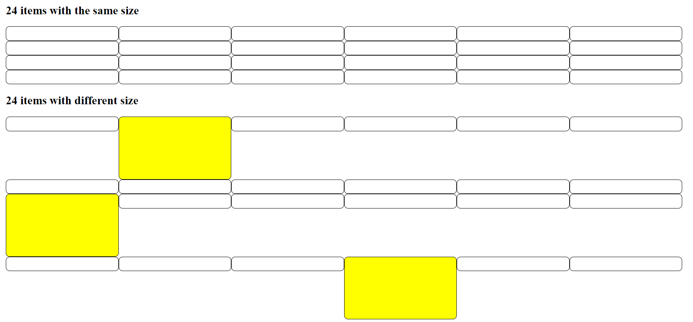

# Grid-based-framework

<p align="center">
    
</p>

The framework's grid system uses rows and columns to layout content, it’s built with float technique and uses media queries to gracefully degrade the site as the window size is reduced.

It works like Twitter's Bootstrap framework with a litle difference: the breack points (col-breakPoint-cellsPerItem)

- col-0-4
- col-576-4
- col-720-4
- col-1024-4
- col-1200-4

## Live Demo
[https://fivan18.github.io/grid-based-framework/](https://fivan18.github.io/grid-based-framework/)

## Page that is using the framework
- [TNW-clone](https://fivan18.github.io/tnw-clone/)
- [repository: https://github.com/fivan18/tnw-clone](https://github.com/fivan18/tnw-clone)


## Getting Started

1. Download [framework.css](css/framework.css) and [framework.js](scripts/framework.js) files
2. Add framework.css and framework.js files to your project
3. Add a link tag inside the head that reference the framework.css file ([like this](index.html))
4. Add two scritp tags rigth before the body-close tag ([like this](index.html))
    1. Set the src property of the first one to reference the framework.js file
    2. Add this code to the second one:
        ```
            function resize() {
                /* 
                    The code that you will put here will depend on the classes that
                    you are using and the maximum number of items that are using
                    that classes.

                    Look at the examples below.
                */
                
                // clearItems("col-576-6", 24);
                // clearItems("col-720-4", 24);
                // clearItems("col-1024-3", 24);
                // clearItems("col-1200-2", 24);
            }
            window.addEventListener("resize", resize);
            resize();
        ```

That's it. Look at the example [here](index.html).

## Authors

👤 **Ivan Ulises Guzman Sanchez**

- Github: [@fivan18](https://github.com/fivan18)
- Twitter: [@fivanunam](https://twitter.com/fivanunam)
- Linkedin: [fivan](https://www.linkedin.com/in/fivan)

## 🤝 Contributing

Contributions, issues and feature requests are welcome!

Feel free to check the [issues page](https://github.com/fivan18/grid-based-framework/issues).

## 📝 License

This project is [MIT](LICENSE) licensed.


